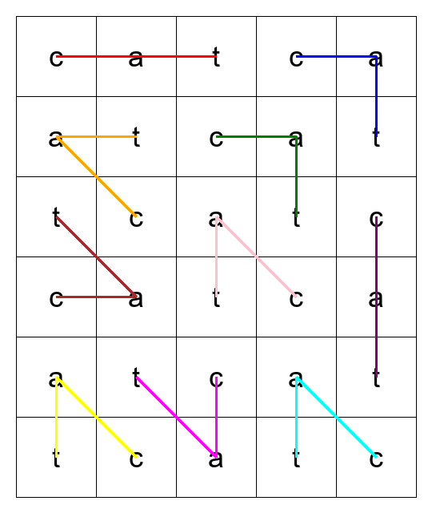

# Sanalouhos Solver

Solver for HS.fi Sanalouhos hidden word puzzle.

## Install

```bash
poetry install
```

## Usage

Edit puzzle.txt to contain the puzzle you want to solve. Then run:

```bash
poetry run sanalouhos-solver
```

## Example result

When running the solver with the example puzzle in puzzle.txt, the result should look like this:


